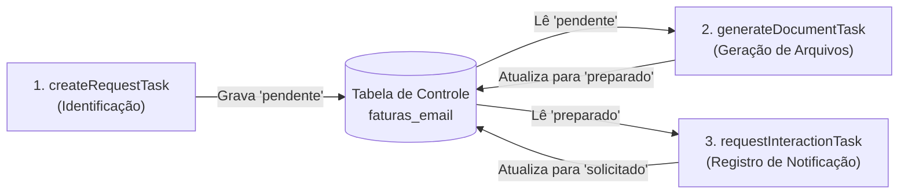

# 📖 Especificação Técnica do Projeto (spec.md)

Este documento descreve as definições de arquitetura, padrões de codificação, modelagem de dados e critérios de resiliência e idempotência adotados no projeto `desktop-fiscal-invoice-email-batch`. Ele serve como guia e padrão técnico para novas melhorias e implementações.

---

## 🏛️ 1. Definições de Arquitetura

O projeto é um microsserviço de processamento em lote construído sobre a seguinte pilha tecnológica:
* **Java 17** (padrão moderno de records, pattern matching e var).
* **Spring Boot 3.5.11 + Spring Batch 5 + Spring Cloud Task**.
* **Gradle 8.7** (gerenciamento de build e dependências).

### 🗄️ Isolamento de Dados (Dual DataSource)
Para separar a infraestrutura de controle do processamento de negócios, a aplicação gerencia dois pools de conexões independentes (HikariCP):
1. **`dataSource` (Primary / Metadados)**: Configurado via `spring.datasource.*`. Armazena o estado das execuções do Spring Batch (`BATCH_*`) e Spring Cloud Task (`TASK_*`).
2. **`adminDataSource`**: Configurado sob o prefixo `app.datasource.admin.*`. Conecta-se à base de operações (tabelas operacionais como `faturas`, `demonstrativos`, `usuarios`, `faturas_email`, `batch_config`).

### 📂 Estrutura de Camadas
As classes devem seguir uma divisão estrita em pacotes no diretório `br.com.desktop.fiscal.invoice.email.batch`:
* `configuration/`: Beans de infraestrutura, definição de Jobs/Steps e instâncias de `RestClient`.
* `properties/`: Mapeamento de propriedades externalizadas resolvidas via Cloud Config Server (`AppProperties`).
* `dto/`: Objetos de transporte imutáveis (`record`).
* `job/`:
  - `reader/`: Configurações de leitura (ex: `JdbcCursorItemReader`).
  - `processor/`: Lógica de transformação e chamadas HTTP.
  - `writer/`: Persistência de resultados via JDBC (ex: `JdbcBatchItemWriter`).
  - `listener/`: Interceptores de ciclo de vida (ex: `StepProgressLoggingListener`).
* `exception/`: Exceções de controle do ciclo de vida da execução.

---

## ⚙️ 2. Pipeline de Processamento (Jobs)

O processamento de e-mails de faturas fiscais é distribuído em três Jobs independentes e sequenciais:



### 📋 Detalhamento dos Jobs

| Job (Bean Name) | Input (Reader Source) | Ação Principal (Processor) | Output (Writer Update) |
|---|---|---|---|
| **`createRequestTask`** | `faturas` / `demonstrativos` | Valida integridade do DTO. | Insere na `faturas_email` com `status = 'pendente'`. |
| **`generateDocumentTask`** | `faturas_email` (`status = 'pendente'`) | POST na API de Documentos (DANFE, XML, Demonstrativo). | Atualiza `status = 'preparado'`, `caminho` ou grava `descricao_erro`. |
| **`requestInteractionTask`** | `faturas_email` (`status = 'preparado'`) | POST na API de Interação com `InteractionRequestDTO`. | Atualiza `status = 'solicitado'`, `interacao_uuid` ou grava `descricao_erro`. |

---

## ⚡ 3. Critérios de Idempotência e Concorrência

Para garantir execuções seguras em ambientes produtivos sem processamento duplicado:
1. **`createRequestTask`**: Utiliza um `LEFT JOIN` com `faturas_email` filtrando onde `fe.id IS NULL` para garantir que faturas já inseridas no lote de controle nunca sejam reprocessadas/duplicadas.
2. **`generateDocumentTask`**: O reader filtra estritamente `status = 'pendente'`. Ao processar com sucesso, o status transiciona para `preparado`. Isso impede que novos triggers processem a mesma fatura.
3. **`requestInteractionTask`**: O reader filtra estritamente `status = 'preparado'`. A execução com sucesso transiciona o registro para `solicitado`, servindo como trava atômica.

---

## 📝 4. Padrões de Codificação e Convenções

Ao implementar ou estender recursos no projeto, obedeça às seguintes regras:

### 4.1. Declaração de DTOs e Classes Imutáveis
* Sempre declare objetos de transferência de dados como **Records** em Java.
* Declare anotações de validação (`jakarta.validation.constraints`) nas propriedades do Record quando pertinente.
* Use a anotação `@JsonPropertyOrder` do Jackson para garantir a ordem exata dos campos na serialização JSON caso a API consumidora possua essa restrição.

### 4.2. Injeção de Dependências
* Priorize **Injeção via Construtor** (preferencialmente utilizando `@RequiredArgsConstructor` do Lombok ou declarando construtores explícitos qualificados).
* Quando houver mais de um bean do mesmo tipo (por exemplo, múltiplos `RestClient` ou `PlatformTransactionManager`), use a anotação `@Qualifier` no construtores.

### 4.3. Tratamento de Erros e Resiliência
* **Deduplicação de Código (DRY):** Evite duplicar inst instanciações repetidas de DTOs de erro nos `ItemProcessor`. Crie e use um método helper privado `createErrorDto(InvoiceEmailDTO item, String errorMsg)` para centralizar os retornos de exceção/validação.
* **Tolerância a Falhas:** Configure os Steps como `.faultTolerant()` definindo as exceções toleráveis em `.skip()` e limite tolerável em `.skipLimit()`.
* **API Multi-Status (207):** Respostas de status 207 da API devem ter seus erros parciais extraídos e formatados em formato JSON estruturado na coluna `descricao_erro` para facilitar a depuração.

### 4.4. Padrões de Logging e MDC
* Use SLF4J através do `@Slf4j` do Lombok.
* Logs de chamada de APIs devem ser configurados em nível `INFO` ou `DEBUG`, contendo a **URL completa** (base + path) e o **body estruturado** (DTO/JSON) para auditoria.
* Utilize o `JobExecutionListener` (`mdcJobListener`) para injetar chaves úteis de rastreabilidade (como `jobExecutionId` e `jobName`) no **MDC** do logback.

---

## 🧪 5. Verificação de Alterações e CI

Antes de subir qualquer melhoria ou abrir um Pull Request, execute obrigatoriamente a sequência:
1. **Compilação Estática:**
   ```bash
   ./gradlew.bat compileJava compileTestJava
   ```
2. **Testes Unitários:**
   ```bash
   ./gradlew.bat test
   ```
3. **Testes de Integração (Requer VPN DEV):**
   ```bash
   ./gradlew.bat integrationTest
   ```

## Sonar

   ```
plugins {
id "org.sonarqube" version "7.3.0.8198"
}

sonar {
properties {
property "sonar.projectName", "Batch Email"
property "sonar.projectKey", "desktop-fiscal-invoice-email-batch"

		// URL do SonarQube local (o padrão é a porta 9000)
		property "sonar.host.url", "http://localhost:9000"

		// Token de autenticação gerado no painel do SonarQube
		property "sonar.token", "sqp_30f1a089d69a07a61e4a319798f58fc73b745156"

		// Opcional: Caminhos para código fonte e binários (geralmente o plugin já detecta automaticamente)
		property "sonar.sources", "src/main"
		property "sonar.tests", "src/test"
		property "sonar.java.binaries", "build/classes"
	}
}
   ```